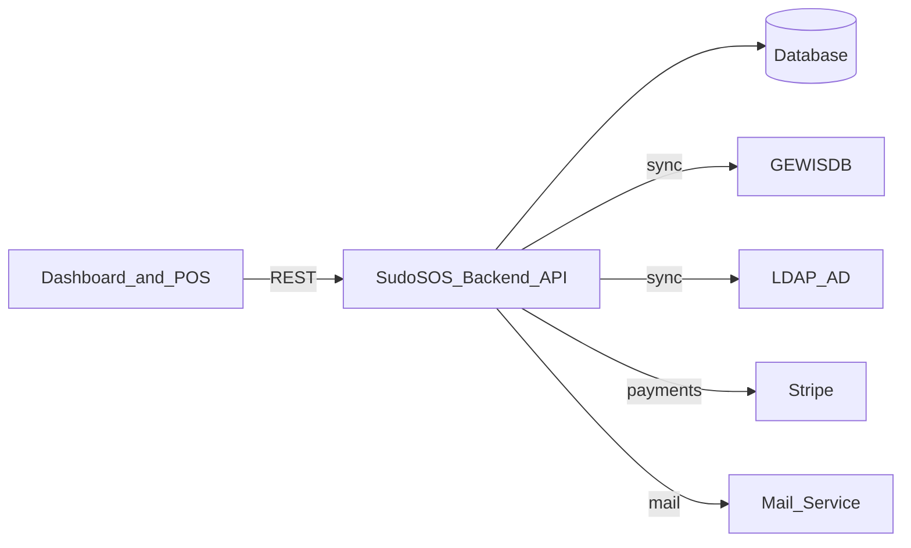

# System Architecture

This page gives you a mental map of the backend: what it talks to, what it owns, and where the rules are enforced.

**After reading this page, you should know** how the backend is structured, and where the rules from **[Core Concepts](/general/1-core-concepts)** are enforced.

## System context

- **Backend is authoritative** for money-changing operations (transactions, transfers, invoices, payouts).
- **Frontend is not trusted** for correctness; it only proposes actions.
- **External systems are sources of truth** for identity/structure and payments; the backend stores what it needs locally.

## Request lifecycle (where things happen)

Most endpoints follow the same shape:

1. `RequestContextMiddleware` assigns a request id, which every log line of the request carries.
2. **Middleware** authenticates the request and attaches a token.
3. `RequestValidatorMiddleware` validates the request body structure against the Swagger spec.
4. `PolicyMiddleware` checks RBAC and `RestrictionMiddleware` applies row-level restrictions.
5. `AsyncValidatorMiddleware` runs registered business-rule specs (which may include async/DB checks). Runs after authorization so unauthorized requests never trigger DB-hitting validation.
6. **Controller handler** translates HTTP to typed input/output.
7. **Service** orchestrates domain logic across multiple entities.
8. **Entities** persist data via TypeORM.

Both `RequestValidatorMiddleware` and `AsyncValidatorMiddleware` return `{ valid: false, errors: string[] }` on failure so callers see a consistent 400 shape.

The practical rule: **controllers should stay thin**. Structural validation belongs in the middleware layers; deeper domain rules belong in a service or, when they need to run before the handler, in a spec registered with `AsyncValidatorRegistry`.

## Logging

Log calls pass a constant message first and their variable parts in an object after
it, for example `logger.trace('invoice.delete', { id })`. A constant message can be
grouped and counted across requests; a message with values interpolated into it
cannot. Never log a whole entity: log the id.

`LOG_FORMAT` picks the output format. `json` emits one object per line and is the
default in production; `pretty` emits readable lines and is the default everywhere
else. Both formats annotate every line with the `requestId` of the request that
produced it, and with the `actorId` once the token middleware has accepted a token.
Code that runs outside a request, such as a cron task, has no such context, so
anything it needs to record it must pass explicitly.

## Audit log

Some financial mutations are recorded in `audit_log_entry`, so it stays answerable
who changed what: invoices, seller payouts, payout requests, write-offs, products,
transfers, fine handouts and deletions, fine waivers, payment requests (creation,
cancellation, marking fulfilled externally), inactive administrative costs, and
voucher groups. `AuditService.log` writes the entry and emits the matching log
line at the `AUDIT` level. Each entry holds the actor, the name that actor had at
the time, the action (`invoice.delete`), the kind and id of the mutated object,
and optionally the fields that changed. The id is stored as a string, so numeric
ids and the uuids of payment requests share one filterable column.

Read them through `GET /audit-logs`, which filters on actor, action, object and a
`createdAt` date range. The `AuditLog` permission gates it; only Super admin holds
it by default.

Two rules keep the trail trustworthy:

- **Append only.** Nothing updates or deletes an entry, and there is no job that
  expires them. Bookkeeping needs the trail to stay complete.
- **Recorded, not derived.** The actor is an argument to `AuditService.log`, never
  read from ambient state, so no code path can quietly record a mutation with no
  actor. Removing a user clears the reference but leaves the entry and the name.

Coverage is maintained by convention in each controller, not enforced by
construction: a new mutating endpoint can skip calling `AuditService.log` and no
test will catch it.

Where the mutating service extends `WithManager`, the controller opens one
`AppDataSource.manager.transaction` and hands its manager to both that service and
`AuditService`, so the entry commits or rolls back with the mutation it describes.
A failed insert answers 500 and leaves nothing changed. That covers:

- invoices: create, update, delete (`InvoiceService`)
- seller payouts: create, update, delete (`SellerPayoutService`)
- write-offs: create (`WriteOffService`, including closing the user)
- transactions: update, delete (`TransactionService`)
- transfers: create, delete (`TransferService`)
- fines: deleting a fine or a fine handout, waiving fines (`DebtorService`)
- payment requests: create, cancel, mark fulfilled (`PaymentRequestService`)
- inactive administrative costs: create, delete (`InactiveAdministrativeCostService`)

This only holds if every write the service makes goes through that manager, so
the services it calls along the way (`TransferService`, `BalanceService`,
`UserService.closeUser`) are handed the same manager.

The other audited endpoints write their entry with `AuditService.logCommitted`
after the mutation has committed. A failed insert there is logged at error level
and the request still succeeds, because a 500 for a change that did happen would
invite a retry that repeats it. That covers:

- payout requests: create, status update (`PayoutRequestService` is static)
- products: create, update, delete (`ProductService` is static)
- voucher groups: create, update (`VoucherGroupService` is static)
- fine handouts: `DebtorService.handOutFines` commits its own transaction and
  emails the fined users before the entry can be written

Purchases are deliberately not recorded. They arrive by the thousand each day and
would bury the handful of monthly invoice and payout changes that the log exists
to surface. `Transaction` is recorded only when one is changed or deleted.

## Where correctness is enforced

Money is not “best effort”. SudoSOS relies on a few hard guarantees:

- **Database transactions**: money-changing operations are executed atomically. If part of the operation fails, none of it is committed.
- **Historical truth via revisions**: products, containers, and points of sale are revisioned. Past purchases must keep referencing the revisions that were current at the time.
- **Balance cache**: balances are stored in the `balance` table and updated from transactions and transfers. Treat it as a cache; the event tables are the real history.
- **Soft deletion**: most entities are not hard-deleted, because financial history must remain auditable.

## Authorisation (RBAC)

RBAC checks live in controller policies. A request is authorised based on:
- action (`get`, `create`, `update`, `delete`)
- relation (`all`, `organ`, `own`)
- resource (e.g. `Transaction`, `Invoice`)
- attributes (which fields may be accessed)

The important part for contributors: **relation is computed per request** (often by loading a resource and comparing its ownership).

## What lives where (backend structure)

At a high level:

- `src/controller/`: routes, RBAC policy, request/response DTOs.
- `src/service/`: domain logic and orchestration.
- `src/entity/`: database models (including revisioned entities).
- `src/middleware/`: auth/token and request shaping.
- `src/rbac/`: roles, permissions, and enforcement helpers.
- `src/gewis/`: GEWIS-specific integrations (sync).

## What this page intentionally does not cover

- Endpoint-by-endpoint API reference. Use Swagger.
- Entity-by-entity code reference. Use TypeDoc.

::: tip References
- Swagger: `https://sudosos.gewis.nl/api/api-docs/`
- TypeDoc: `/typedoc/`
:::
